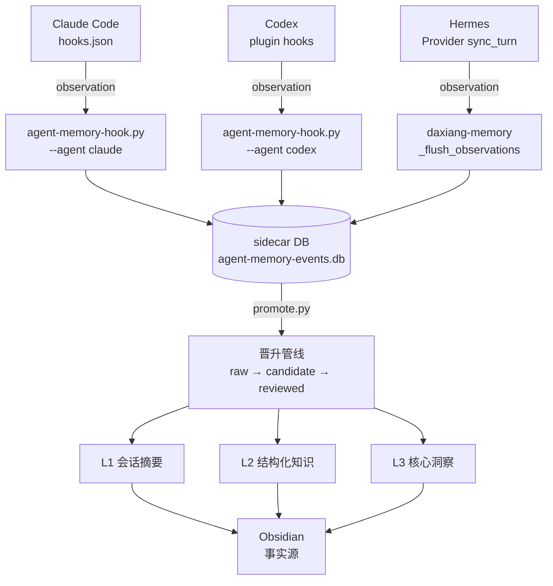

# 一个命令，让 Claude Code 拥有永久记忆

**来源**: https://waytoagi.feishu.cn/wiki/NepcwPlsriYL3tkNmtFc237gn1e

---

## 摘要

claude-mem是一个为Claude Code添加永久记忆的npm工具，通过hooks机制自动记录AI每次操作并将其压缩为知识卡存入本地数据库，新会话启动时自动加载，实现跨会话记忆持久化。作者因同时使用多个AI编程工具且各自记忆系统互不相通，深入研究claude-mem架构后将其改造成三端共享的记忆底座，实现跨Agent记忆共享。

---

## 正文

> 预计字数：5500 字  阅读时间：15 分钟  难度等级：⭐⭐（小白友好，技术细节有类比翻译）  
> 核心价值：看完能用 claude-mem 给 AI 装上永久记忆，理解跨 Agent 记忆共享的架构设计

---


81,391 颗星⭐️。

这是一个 npm 包的 GitHub 星标数。

不是 Next.js，不是 React，不是任何你听过的大项目。

是一个叫 claude-mem 的小工具。

它做了一件事：**让你的 Claude code 拥有永久记忆**。

关掉对话重新打开，它还记得你上次改了什么文件、遇到了什么报错、用了什么命令。

就像一个从不遗忘的同事。

一条命令就能装好：

```bash
npx claude-mem install
```

装完之后重启 Claude Code，它会自动开始工作。

没有任何配置。

但用了之后发现一个问题。

**我同时用三个 AI 编程工具。**

Claude Code 写代码，Hermes 做日常助理和内容创作，Codex 做结构化开发。

三个工具各有各的记忆系统，互不相通。

Claude Code 记得我在项目 A 修了什么 bug，Hermes 不知道。

Hermes 知道我偏好什么写作风格，Claude Code 不知道。

我需要的不只是一个工具的记忆。

我需要三端共享的"外脑"。

所以我拆开了 claude-mem，研究它的架构，然后做了一件事：**把它改造成三端共享的记忆底座。**

这篇文章就是改造记录。

有架构、有代码、有踩坑。

---


# claude-mem 是怎么工作的

先说一个不太恰当但很好理解的类比。

你有个助理，每次你让他做什么事，他就在笔记本上记一笔。

做完之后，他会把笔记整理成两份。

- 一份是"今天做了什么"的流水账。
- 另一份是"学到了什么"的知识卡。

流水账过一阵就丢了，知识卡永久保存。

下次你问他问题，他会先翻知识卡。

找到相关的，直接告诉你。

<callout emoji="🐵">
**概念定义：** 
claude-mem 就像一个挂在 Claude Code 手边的笔记本系统。
Claude 每调用一个工具
- 读文件
- 跑命令
- 写代码
笔记本就记一笔。
等 Claude 干完活，它把流水账压缩成知识卡，存进本地数据库。
下次开会话，知识卡自动喂给 Claude。
</callout>

claude-mem 就是这个笔记本。

---

### 它是怎么"挂"上去的？

Claude Code 有一个叫 hooks 的机制。

你可以在 `~/.claude/settings.json` 里配一系列钩子。

Claude 每次做特定动作，就自动触发这些钩子。

claude-mem 装好之后，它在 Claude Code 的插件目录里放了一个 `hooks.json`，注册了五个钩子。

简化版长这样：

```json
{
  "hooks": {
    "SessionStart": [
      {
        "matcher": "startup|clear|compact",
        "hooks": [{
          "type": "command",
          "command": "node worker-service.cjs start",
          "timeout": 60
        }, {
          "type": "command",
          "command": "node worker-service.cjs hook claude-code context",
          "timeout": 60
        }]
      }
    ],
    "UserPromptSubmit": [{
      "hooks": [{
        "type": "command",
        "command": "node worker-service.cjs hook claude-code session-init",
        "timeout": 60
      }]
    }],
    "PostToolUse": [{
      "matcher": "*",
      "hooks": [{
        "type": "command",
        "command": "node worker-service.cjs hook claude-code observation",
        "timeout": 120
      }]
    }],
    "Stop": [{
      "hooks": [{
        "type": "command",
        "command": "node worker-service.cjs hook claude-code summarize",
        "timeout": 120
      }]
    }]
  }
}
```

真实配置比这长得多。

每条命令前面有一大堆路径查找逻辑，因为它要兼容不同操作系统、不同 Node 版本、不同安装路径。

但核心逻辑就这些：**四个时间点，四个动作**。

### 四个钩子的数据流

我把它的工作流画成一条线，你一眼就能看懂。

- **SessionStart** → 启动后台服务，加载历史记忆上下文。

  - Claude 一开对话，claude-mem 就把之前积累的知识喂给它。
  - Claude 一上来就知道你之前做过什么。
- **UserPromptSubmit** → 记录你说了什么。

  - 每次输入 prompt，它都捕获下来，用于理解对话意图。
- **PostToolUse** → 核心环节。

  - Claude 每调用完一个工具（读文件、写代码、跑命令），这个钩子就触发。
  - claude-mem 从工具的输入输出里提取关键信息，生成一条 observation。

一次典型的 observation 长这样：

```json
{
  "tool": "Write",
  "input": {
    "file_path": "/src/api/routes.ts",
    "content": "export async function handler(req, res) { ... }"
  },
  "output": {
    "result": "File written successfully",
    "size": 2048
  },
  "timestamp": "2026-06-09T10:30:00Z",
  "session_id": "abc123"
}
```

- **Stop** → Claude 停止工作时，claude-mem 把本轮积累的所有 observation 喂给 LLM，

  - 压缩成 narrative（叙述）、facts（事实）、concepts（概念）三部分，存入长期记忆。

> 已省略 Setup 和 PreToolUse"

<callout emoji="🥛">
**我的感悟：** 
这个设计很聪明。
它不是把所有对话原文都存下来——那太浪费了。
它只存"做了什么"和"学到了什么"。
LLM 就是中间的编辑，把流水账提炼成知识卡。
不是存原文，是存理解。
</callout>


### 存在哪里？

底层是 SQLite，加了两层搜索能力。

FTS5 做全文搜索，支持向量搜索（PostgreSQL pgvector 风格）。

你问它"上次那个 API 报错怎么修的"，它能通过关键词和语义两种方式找到答案。

---

# 为什么我不能只装一下就完事

claude-mem 装上之后，Claude Code 确实有了记忆。

但我的问题没解决。

坦白说，claude-mem 解决的是"单 Agent 的记忆"问题。

你用 Claude Code 写代码，它记得你改了什么。

但你换到 Hermes 问"我上次在 Claude Code 里修的那个 API bug，具体改了哪些文件"，Hermes 只能一脸茫然。

这不是 claude-mem 的 bug。

这是架构局限。

claude-mem 的记忆库是和 Claude Code 绑定的。

存储路径、索引方式、知识格式，都为 Claude Code 服务。

其他 Agent 进不来。

<callout emoji="📚">
**三个工具三个脑子，互相不通。** 
就像三个同事，各自记各自的笔记，从不分享。
Claude Code 知道你修了 bug，Hermes 知道你写文章喜欢什么风格，Codex 知道你项目结构怎么搭。
但它们互相不知道。
</callout>

我的真实场景是这样的。

比如我在 Claude Code 里修了一个 API 路由的 bug，改了 `routes.ts` 和 `middleware.ts` 两个文件。

Claude Code 记得这件事。

但第二天我在 Hermes 里写一篇关于这次 bug 修复的技术文章时，Hermes 完全不知道这件事发生过。

我得手动把修 bug 的细节复制过来告诉它。

更头疼的是写作风格。

Hermes 知道我写文章喜欢口语化、短句、不用黑话。

Claude Code 不知道这些。

每次让它帮我写文档，出来的都是"综上所述""值得注意的是"这种 AI 味满满的官样文章。

<callout emoji="🎼">
claude-mem 的思路没问题，但格局不够大。
它把"事件采集"和"长期记忆"绑在一个 Agent 里。
正确的做法是拆开
**所有 Agent 的事件汇入一个公共池，再由统一的系统筛选、提炼、晋升为长期知识**。
</callout>

于是我开始动手改造。

---

# 三端共享架构设计

这一章是干货最多的部分。

我尽量讲清楚。

### 整体架构

先看架构图：



三端各自通过自己的 hook 或 Provider 接口采集事件，全部写入同一个 sidecar DB。

sidecar DB 不属于任何一个 Agent，是独立的中转站。

原始事件在 sidecar DB 里经过筛选和晋升，高价值的才进入 Hermes 的三级记忆系统，最终同步到 Obsidian。

---


### 三个核心设计决策


**第一，sidecar DB 放在哪里？**

我选了 `~/.hermes/state/agent-memory-events.db`。

这个路径不属于 Claude Code，不属于 Codex，不属于 Hermes。

它属于"大象的 Agent 体系"。

不管你用哪个工具，事件都往这里写。


这个决定看起来很小，其实是整个架构的地基。

如果 sidecar DB 放在某个 Agent 的目录下，那个 Agent 就天然地成了"主人"，其他工具就成了"客人"，

共享就变成了寄生。

**第二，原始事件直接进长期记忆吗？**

不。

说实话，AI 工具每天产生的原始事件量很大。

Claude Code 执行一条 `ls` 命令，读一个文件，这些都是"事件"，但它们对长期记忆毫无价值。

如果全都灌进记忆系统，记忆会被噪声淹没。

我的做法是加了一层"晋升"机制。

原始事件先在 sidecar DB 里待着，状态是 `raw`。

只有经过筛选的：

- 有明确结论的
- 有踩坑价值的
- 能跨会话复用的

才会被标记为 `candidate`，再经过审核后晋升到 Hermes 的 L1/L2/L3。

这就像公司的知识库。

不是每条聊天记录都能发公司内网。

得有人筛选、编辑、审核，才能变成文档。


**第三，三端怎么接入？**

- Claude Code 和 Codex 通过 hooks 接入，Hermes 通过 Provider 接入。
- 但底层共用同一个脚本 `agent-memory-hook.py`，通过 `--agent` 参数区分来源。

<callout emoji="🎹">
**方法论：** 
一个脚本服务三个工具。
这比 claude-mem 原版的做法简单得多：
claude-mem 为 Claude Code 和 Codex 分别维护了两套完整的 hook 逻辑和 worker 服务。
我用一个 Python 脚本 + 一个 `--agent` 参数搞定。
只要事件格式统一，谁写进来的不重要。
</callout>

### Codex 的 hooks 配置

Codex 的 adapter 已经有完整的 hooks.json 配置了，直接贴真实代码：

```json
{
  "hooks": {
    "SessionStart": [
      {
        "hooks": [
          {
            "type": "command",
            "command": "python3 /Users/dx/Hermes-agent/20-Github 自管/agent-memory-core/scripts/agent-memory-hook.py --agent codex --event SessionStart",
            "timeout": 5
          }
        ]
      }
    ],
    "UserPromptSubmit": [
      {
        "hooks": [
          {
            "type": "command",
            "command": "python3 /Users/dx/Hermes-agent/ 自管中转 /agent-memory-core/scripts/agent-memory-hook.py --agent codex --event UserPromptSubmit",
            "timeout": 5
          }
        ]
      }
    ],
    "PostToolUse": [
      {
        "matcher": ".*",
        "hooks": [
          {
            "type": "command",
            "command": "python3 /Users/dx/Hermes-agent/ 自管中转 /agent-memory-core/scripts/agent-memory-hook.py --agent codex --event PostToolUse",
            "timeout": 10
          }
        ]
      }
    ],
    "Stop": [
      {
        "hooks": [
          {
            "type": "command",
            "command": "python3 /Users/dx/Hermes-agent/ 自管中转 /agent-memory-core/scripts/agent-memory-hook.py --agent codex --event Stop --enqueue-summary",
            "timeout": 30
          }
        ]
      }
    ]
  }
}
```

四个钩子，SessionStart、UserPromptSubmit、PostToolUse、Stop。

每个都指向同一个脚本 `agent-memory-hook.py`，用 `--agent codex` 标记来源。

PostToolUse 的 matcher 设成 `.*`，意思是所有工具调用都捕获。

Stop 钩子多了一个 `--enqueue-summary` 参数，告诉脚本在会话结束时生成摘要。


Claude Code 的 adapter 我还没创建。

目录 `adapters/claude-code/` 还不存在。

但配置逻辑一样，只是把 `--agent codex` 换成 `--agent claude`。

### sidecar DB 的表结构

这是真实 schema，从我的 `agent_memory_core/db.py` 里提取的：

```sql
-- 会话表：记录每个 Agent 的每次会话
CREATE TABLE IF NOT EXISTS agent_sessions (
  id TEXT PRIMARY KEY,
  agent TEXT NOT NULL,          -- claude / codex / hermes
  project_path TEXT,            -- 工作目录
  started_at TEXT NOT NULL,
  ended_at TEXT,
  source_session_id TEXT,       -- 原始会话 ID
  title TEXT
);

-- 事件表：每次工具调用产生一条记录
CREATE TABLE IF NOT EXISTS agent_events (
  id INTEGER PRIMARY KEY AUTOINCREMENT,
  session_id TEXT NOT NULL,
  agent TEXT NOT NULL,
  event_type TEXT NOT NULL,     -- observation / error / decision
  created_at TEXT NOT NULL,
  project_path TEXT,
  tool_name TEXT,               -- 具体调了哪个工具
  content_summary TEXT NOT NULL,  -- 人类可读的摘要
  content_json TEXT NOT NULL DEFAULT '{}',  -- 原始结构化数据
  sensitivity TEXT NOT NULL DEFAULT 'normal',
  FOREIGN KEY(session_id) REFERENCES agent_sessions(id)
);

-- 摘要表：会话结束时 LLM 生成的总结
CREATE TABLE IF NOT EXISTS agent_summaries (
  id INTEGER PRIMARY KEY AUTOINCREMENT,
  session_id TEXT NOT NULL,
  agent TEXT NOT NULL,
  created_at TEXT NOT NULL,
  summary TEXT NOT NULL,
  learned TEXT,
  files_read TEXT,
  files_modified TEXT,
  promote_status TEXT NOT NULL DEFAULT 'pending',
  FOREIGN KEY(session_id) REFERENCES agent_sessions(id)
);

-- 全文搜索索引：FTS5 虚拟表
CREATE VIRTUAL TABLE IF NOT EXISTS agent_events_fts USING fts5(
  content_summary,
  content_json
);
```

三张业务表加一个 FTS5 虚拟表。

<callout emoji="🥖">
**用笔记本类比来理解：**
- `agent_sessions` 是笔记本的封面

  - 记录"哪天、谁、在哪个项目上工作"。
- `agent_events` 是笔记本的内页

  - 每一页记录一次操作。
- `agent_summaries` 是笔记本最后的总结页

  - "今天做了什么，学到了什么"。
- `agent_events_fts` 是笔记本的索引

  - 帮你快速翻到相关页。
</callout>

### Hermes 端的 observation 提取

Claude Code 和 Codex 是通过外部 hook 脚本采集事件的。

Hermes 不一样。

它有自己的 Provider 机制，可以在每轮对话结束后直接从 messages 里提取信息。

这段逻辑在我的 `daxiang-memory` Provider 插件里。

核心方法是 `sync_turn`：

```python
def sync_turn(self, user_content: str, assistant_content: str, *,
              session_id: str = "", messages: Optional[List[Dict[str, Any]]] = None) -> None:
    """从 messages 中提取本轮工具调用 observation，写入 sidecar。"""
    if not messages or not self._db:
        return
    try:
        observations = self._extract_observations(messages)
        if observations:
            self._turn_observations.extend(observations)
            # 超过 5 条或累计超过 2000 字符时批量写入
            total_chars = sum(len(o["text"]) for o in self._turn_observations)
            if len(self._turn_observations) >= 5 or total_chars >= 2000:
                self._flush_observations()
    except Exception as e:
        logger.debug("sync_turn observation extraction failed: %s", e)
```

`_extract_observations` 做的事情是：

扫描最近 3 条 assistant message，找到里面的 `tool_calls`，对每个工具调用提取参数摘要和结果摘要。

跳过低价值的元工具（memory 自身、todo、cron 这些不需要记录的），最后返回一个 observation 列表。

`_flush_observations` 把缓冲区里的 observation 写入 sidecar DB：

```python
def _flush_observations(self) -> None:
    """将缓冲的 observation 写入 sidecar DB。"""
    if not self._turn_observations:
        return
    sidecar = self._get_sidecar()
    if sidecar is None:
        self._turn_observations = []
        return
    try:
        for obs in self._turn_observations:
            # 三层过滤
            if len(obs["text"]) < 30:
                continue
            low_value_signals = ("exit_code", "exit: 0", "[SILENT]",
                                 "usage:", "entry_count:", "hits:")
            if any(sig in obs["text"] for sig in low_value_signals):
                continue

            sidecar.add_event(
                session_id=self._session_id or "hermes-unknown",
                agent="hermes",
                event_type="observation",
                project_path="/Users/dx/Hermes-agent",
                tool_name=obs["tool"],
                content_summary=obs["text"][:500],
                content_json=obs,
                sensitivity="normal",
            )
    except Exception as e:
        logger.debug("_flush_observations to sidecar failed: %s", e)
    finally:
        self._turn_observations = []
```

`_get_sidecar` 做延迟初始化——只在第一次需要时才加载 sidecar DB 连接，不影响 Hermes 启动速度：

```python
def _get_sidecar(self) -> "AgentMemoryDB":
    """延迟初始化 sidecar DB。"""
    if self._sidecar_db is None:
        try:
            _sidecar_core = str(Path(os.path.expanduser(
                "~/Hermes-agent")).joinpath(
                "20-Github 自管", "agent-memory-core"))
            sys.path.insert(0, _sidecar_core)
            from agent_memory_core.db import AgentMemoryDB
            self._sidecar_db = AgentMemoryDB()
            self._sidecar_db.init_schema()
        except ImportError:
            logger.debug("agent_memory_core not available, sidecar disabled")
            return None
    return self._sidecar_db
```

> **这三段代码加起来不到 100 行，但让 Hermes 成了三端记忆共享的桥梁。**
> 
> Claude Code 和 Codex 通过外部 hook 写入 sidecar，Hermes 通过 Provider 内部 hook 写入 sidecar。
> 
> 三个工具的事件汇入同一个地方。
> 
> 你用 Claude Code 修了一个 bug，Hermes 马上就能在 sidecar 里找到这条记录。

### 和 claude-mem 原版对比

| 维度 | claude-mem 原版 | 我的三端方案 |
|-|-|-|
| 服务对象 | 单 Agent | 三端共享 |
| 记忆存储 | 各 Agent 独立 | 统一 sidecar DB |
| 长期记忆 | 自建 SQLite + Chroma | 复用 Hermes 三级记忆系统 |
| 晋升机制 | LLM 自动压缩 | 人工审核 + 自动筛选 |
| hook 脚本 | 每端一套完整 worker | 一个脚本 + 参数区分 |

claude-mem 的优势是开箱即用，一个命令搞定。

我的方案优势是三端知识互通，且长期记忆有 Obsidian 做事实源，不怕丢。

两者不矛盾——我是站在 claude-mem 的肩膀上做的改造。


```Markdown
# 实施顺序
## P0：整合设计落盘

将文档作为三端构建基准。
将旧 codex-memory-plugin-plan 降级为 Codex adapter 参考，
不再作为独立系统方案。
在 持久化层/记忆系统.md 
插件系统/记忆 Provider 插件.md 补入口链接。

## P1：shared core 骨架
创建 agent-memory-core 仓库骨架。
实现 SQLite schema、脱敏、写入、搜索、status。
不启用任何 hook，只跑 CLI 单元测试。

## P2：Claude Code adapter 先接入
先用 Claude Code hook 验证事件输入，因为 Claude Code hook 形态更明确。
只采集 SessionStart、UserPromptSubmit、PostToolUse、Stop。
验证 hook 失败不阻塞 Claude。

## P3：Codex adapter 接入
复用同一 hook 脚本。
做 .codex-plugin/plugin.json、hooks、MCP、Skill 映射。
验证 Codex 新会话能看到轻量历史索引。

## P4：Hermes 晋升桥
从 sidecar DB 生成 L1 候选。
人工审核后再批量晋升 L2/L3。
Obsidian 同步仍走 Hermes 现有三级记忆管线。

## P5：自动化和健康检查
Cron 检查 DB 大小、hook 错误率、未处理队列。
每日蒸馏候选写到 Obsidian，默认不自动晋升高层记忆。
```

---

# 实际效果

说说改造完之后实际跑起来的效果。

### Hermes 的 observation 捕获

现在 Hermes 每轮工具调用结束后，`sync_turn` 都会自动执行。

它会扫描 assistant 的 `tool_calls`，提取参数摘要和结果摘要，写入 sidecar DB。

举个例子：我用 Hermes 让它读一个 Python 文件，它会生成这样的 observation：

```
[read] /Users/dx/Hermes-agent/20-Github 自管/agent-memory-core/agent_memory_core/db.py
```

如果让它执行一条命令，生成的是：

```
[terminal] python3 -m unittest discover -s tests -v
```

这些 observation 先进缓冲区，积累到 5 条或 2000 字符时批量写入 sidecar DB。

这个缓冲机制很重要——如果每个工具调用都单独写一次数据库，I/O 开销会很大。

### 三层过滤

不是所有 observation 都值得保留。

> ❌ **不是所有 observation 都值得保留。** 
> 
> 我在 `_flush_observations` 里加了三层过滤，大部分低价值记录在写入前就被拦住了。

1. **太短的跳过**：observation 文本少于 30 字符的，直接丢掉。一条 `ls` 命令的输出没有记忆价值。
2. **低价值信号跳过**：如果文本里包含 `exit_code`、`exit: 0`、`[SILENT]`、`usage:`、`entry_count:`、`hits:` 这些信号，说明是一次无意义操作，跳过。
3. **重叠去重**：这一层在 `on_memory_write` 里已经实现了——检查已有记录的内容重叠度，超过 60% 就跳过。observation 端的完整去重还在路上。

三层过滤下来，真正进入 sidecar 的大概是原始 observation 的三分之一。噪声少了很多。

### FTS5 搜索能力

sidecar DB 上的 FTS5 虚拟表支持全文搜索。

我在 `AgentMemoryDB.search` 方法里实现了这个能力。

搜索时先把用户的自然语言查询转成 FTS5 语法：

把查询词用 `OR` 连接，每个词加双引号，最多取前 12 个 token。

如果 FTS5 查询失败（比如包含特殊字符），会自动降级为 `LIKE` 模糊搜索。

这意味着你可以用 `agent-memory search "API bug 修复"` 来搜索，不需要精确匹配。

它还支持按 agent 过滤——只看 Claude Code 的记录，或者只看 Hermes 的。

### 改造前 vs 改造后

| 维度 | 改造前 | 改造后 |
|-|-|-|
| 记忆覆盖范围 | Claude Code 单端 | Claude Code + Hermes + Codex 三端 |
| 搜索能力 | 各 Agent 独立搜索 | 统一 sidecar DB 全文搜索 |
| 跨 Agent 知识共享 | 不支持 | sidecar DB 统一存储，支持 |
| 长期记忆 | claude-mem 自建 | 复用 Hermes 三级记忆 + Obsidian |
| 噪声控制 | LLM 自动压缩 | 三层过滤 + 晋升审核 |
| 事实源 | 无统一事实源 | Obsidian 唯一事实源 |

坦白说当前进度：sidecar DB + Hermes Provider 已经跑通了，Codex 的 hooks.json 也已经配置好就位。

Claude Code 的 adapter 目录 `adapters/claude-code/` 还没创建，这是下一步要做的。

但核心架构和代码已经落地，数据流通路已经打通。

---


# 还有点话

折腾了一圈，最大的收获不是代码，是一个认知。

AI 工具的记忆，不是"记得你说过什么"。

你说过什么，对话历史里本来就有。

AI 工具的记忆，是**在正确的时候把正确的上下文喂给 AI**。

claude-mem 在 Claude Code 开会话时，从历史记忆里捞相关片段塞进 system prompt。

Claude 一上来就知道你之前做过什么、踩过什么坑。

这比你自己手动把背景信息复制粘贴进新对话，效率高太多了。

但我更想说的是后面那一步——三端共享。

工具是工具，记忆是记忆。

Claude Code 是个好工具，Hermes 是个好工具，Codex 也是。

但它们的记忆不应该被绑定在各自工具里。

分开管，比绑在一起强。

把事件采集和长期记忆拆开，所有 Agent 的事件汇入公共池，再由统一的系统筛选和沉淀。

这个思路不仅适用于 AI 工具，也适用于任何需要跨系统知识共享的场景。

说到底，一个人同时用好几个 AI 工具的时候，最需要的不是每个工具都变得更强，而是让它们之间能说上话。

**记忆不绑定工具，工具才能为你所用。**


既然看到这里了，如果觉得不错，随手点个赞、在看、转发三连吧，如果可以给我个星标⭐，将不胜感激～谢谢你看我的文章，我们，下次再见。

---

#AI编程 #ClaudeCode #Hermes #Codex #永久记忆 #AI工具


**作者**：大象-推动 AI 共学，让普通人轻松上手AI

**相关链接**

1. claude-mem GitHub：https://github.com/thedotmack/claude-mem
2. Claude Code 官方文档：https://docs.anthropic.com/en/docs/claude-code
3. Hermes Agent 文档：https://hermes-agent.nousresearch.com/docs


公众号：大象 AI 共学  个人号：Yishouhundanqu（注明来意）