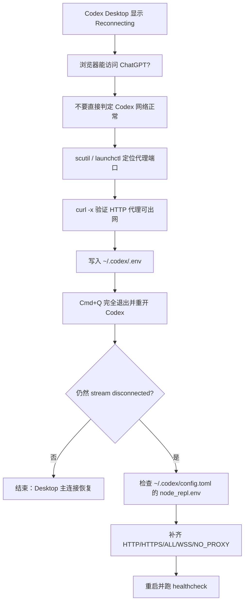

# Codex一直重连？先别急着卸载重装，给它几分钟

**来源**: https://waytoagi.feishu.cn/wiki/JEZ7wtZdHiaXHRkfGAQcwyjhnYd

---

## 摘要

Codex Desktop显示“Reconnecting”时，即便浏览器网络正常也不应盲目重装或瞎猜，因为终端代理环境变量不一定对GUI应用生效。正确做法是先分层排障，区分主连接与工具调用链路，建立一条可验证的代理链路，即找出真实代理端口，验证其出网能力，将正确代理环境写入Codex可读取的配置中，最后完全重启应用，若仍断开再深入排查。

---

## 正文

> 预计字数：7000 字  阅读时间：18 分钟  难度等级：⭐⭐⭐（需要会复制终端命令）  
> 核心价值：当 Codex Desktop 一直显示 `Reconnecting` 时，用一条可验证的代理链路，把问题从瞎猜变成可定位。


我这两天碰到一个挺典型的问题。

Codex Desktop 一直显示：

```text
Reconnecting.........
```

看起来像是网络断了。

但奇怪的是，浏览器能打开 ChatGPT，本地代理也在运行，系统网络也正常。

这时候很多人的第一反应是：

是不是账号坏了？

是不是 OpenAI 服务挂了？

要不要重装 Codex？

说实话，先别急。

这类问题最容易误判的地方在于：

**浏览器能上网，不等于 Codex 这个进程能上网。**

浏览器可能走系统代理，可能走扩展，可能有自己的网络栈。

Codex Desktop 是另一个 macOS GUI App。

它有没有拿到正确的代理环境，是另一回事。

这篇文章不讲玄学。

只讲一条排障链路：

```text
Reconnecting
-> 找真实代理端口
-> 验证代理协议能出网
-> 写入 Codex 可读取的代理环境
-> 完全重启 Codex Desktop
-> 仍然断，再查 MCP / node_repl
```

你不需要记住某个固定端口。

你只需要记住一个判断：

**排障不是背端口，是建立验证链。**

---


# 先说清楚：Reconnecting 不是一个原因

`Reconnecting` 这个提示很烦。

因为它不是一个具体错误。

它更像汽车仪表盘上的总故障灯。

灯亮了，你知道车有问题。

但它没告诉你，到底是轮胎、油路、电瓶，还是传感器。

OpenAI Developer Community 上也有人提到过类似情况：Codex Desktop 在 macOS 上卡在 `Reconnecting`，背后可能是网络可达性、WebSocket 超时、会话失效、MFA、服务端临时问题等不同原因。

所以第一步不是猜。

第一步是分层。

我这次把它拆成两层：

1. **Codex Desktop 主连接**

也就是 UI 本身能不能连上，能不能从 `Reconnecting` 里出来。

1. **工具和流式调用链路**

也就是主界面能用了，但 MCP、`node_repl`、stdio worker 或流式响应还会不会出现 `stream disconnected before completion`。

这两层不能混在一起。

一混，排障就会变成一锅粥。

<callout emoji="🪄">
 **最常见误区：**
一看到 `Reconnecting`，就直接开始改 `config.toml`、重装 App、换账号、换节点。
这些都可能有用，但顺序不对。
先确认 Codex 主进程有没有走到正确代理，再进入复杂排查。
</callout>

---

# 问题本质：GUI App 不一定吃终端里的代理

很多人会在终端里写：

```zsh
export HTTP_PROXY=http://127.0.0.1:7890
export HTTPS_PROXY=http://127.0.0.1:7890
```

然后以为所有 App 都走代理了。

不一定。

你从终端启动的命令，能继承当前 shell 的环境变量。

但你从 Dock、Finder、Spotlight 打开的 GUI App，不一定继承你终端里的 `export`。

这就是 macOS 上很多代理问题的根。

你以为你给系统铺了一条路。

实际上只给终端这一扇门铺了。

Codex Desktop 从另一扇门出来，可能根本没看到。

所以我们先查三件事：

- 系统代理现在是什么。
- launchd 环境有没有代理。
- Codex 自己的配置里有没有代理。

---


### 第一步：别抄端口，先查真实端口

网上很多教程喜欢直接写：

```text
127.0.0.1:7890
```

或者：

```text
127.0.0.1:7897
```

别盲抄。

不同代理客户端，不同配置，端口可能完全不一样。

Clash Verge、Mihomo、sing-box...，每个人本地都可能不同。

先查系统代理：

```zsh
scutil --proxy
```

重点看这些字段：

```text
HTTPEnable
HTTPProxy
HTTPPort
HTTPSEnable
HTTPSProxy
HTTPSPort
SOCKSEnable
SOCKSPort
```

如果你看到类似：

```text
HTTPProxy  : 127.0.0.1
HTTPPort   : <实际端口>
HTTPSProxy : 127.0.0.1
HTTPSPort  : <实际端口>
SOCKSProxy : 127.0.0.1
SOCKSPort  : <实际端口>
```

说明系统层面确实指向了本地代理。

但这还不够。

继续查 launchd 环境：

```zsh
launchctl getenv HTTP_PROXY
launchctl getenv HTTPS_PROXY
launchctl getenv ALL_PROXY
launchctl getenv WSS_PROXY
```

如果这些为空，不代表系统代理没开。

它只说明 GUI App 从 launchd 那条链路拿环境变量时，不一定能拿到你想要的代理。

这就是为什么浏览器正常，Codex 仍然重连。

<callout emoji="🪄">
**一句话翻译：**
`scutil --proxy` 看的是 macOS 系统代理设置，`launchctl getenv` 看的是 GUI 进程能不能从 launchd 环境里拿到代理变量。它们不是同一个东西。
</callout>

---

### 第二步：确认这个端口真的支持 HTTP 代理

查到端口之后，不要马上写配置。

先验证。

假设你查到的端口是 `<实际端口>`，跑：

```zsh
curl -sS --max-time 10 -x http://127.0.0.1:<实际端口> \
  'https://api.ipify.org?format=json'
```

能返回一个公网出口 IP，才说明这个端口可以用 HTTP 代理协议访问外网。

这里有个细节。

很多代理客户端有 `mixed-port`。

mixed port 可以同时处理 HTTP 和 SOCKS 等协议。

但你写给 `HTTP_PROXY` 和 `HTTPS_PROXY` 的时候，通常应该写成：

```text
http://127.0.0.1:<实际端口>
```

不是：

```text
socks5://127.0.0.1:<实际端口>
```

除非你明确知道当前这条链路支持 SOCKS，并且 Codex 当前使用的网络库对这个写法没有问题。

对普通排障来说，我建议先用已经验证过的 HTTP proxy URL。

少一个变量，就少一个坑。

---

### 第三步：给 Codex 写最小 `.env`

素材里这次最小修复点是：

```text
~/.codex/.env
```

也就是在 Codex 的本地状态目录里，放一个只包含代理变量的环境文件。

注意，这一点要说清楚：

**这是我亲测有效的修复点，也有社区案例支持，但不要把它理解成官方唯一推荐方案。**

> 官方文档明确公开的是：
> 
> Codex 用户级配置在 `~/.codex/config.toml`，MCP 也通过 `config.toml` 配置。
> 
> 而 `.env` 这条路径，在这次本地代理环境里有效。

你可以把它理解成：

先给 Codex 主进程一个最小代理环境。

创建文件：

```zsh
mkdir -p "$HOME/.codex"
touch "$HOME/.codex/.env"
```

如果你只写最小配置：

```zsh
cat > "$HOME/.codex/.env" <<'EOF'
HTTP_PROXY="http://127.0.0.1:<实际端口>"
HTTPS_PROXY="http://127.0.0.1:<实际端口>"
EOF
```

如果你的 `.env` 里已经有其他配置，不要整文件覆盖。

只替换这两行。

然后验证这个文件能不能被 shell 正常解析：

```zsh
env -i /bin/zsh -lc '
set -a
. "$HOME/.codex/.env"
set +a
printf "HTTP_PROXY=%s\nHTTPS_PROXY=%s\n" "$HTTP_PROXY" "$HTTPS_PROXY"
'
```

你应该看到：

```text
HTTP_PROXY=http://127.0.0.1:<实际端口>
HTTPS_PROXY=http://127.0.0.1:<实际端口>
```

如果这里都不对，先别打开 Codex。

配置还没生效。

<callout emoji="🪄">
**方法论提醒：**
写配置之前先验证端口，写完配置之后先验证解析。不要靠感觉排障。
</callout>

---

### 第四步：完全退出 Codex Desktop

这一步很容易被忽略。

只关窗口不够。

已经启动的 GUI 进程，不会因为你刚改了 `.env` 或 `launchctl`，就自动刷新环境。

你需要完全退出：

- 用 `Cmd + Q`
- 或者菜单栏 `Codex -> Quit Codex`
- 然后重新从 Dock / Finder / Spotlight 打开

如果它还卡住，再打开活动监视器，把所有 `Codex` 相关进程结束掉，再重新打开。

这不是玄学。

就是进程环境变量的基本逻辑。

进程启动时拿到什么环境，运行中一般就是什么环境。

你改了门牌号，已经进屋的人不会自动知道。

---

### 第五步：还是断？再查日志，不要贴完整日志

如果重启后还是不行，就不要继续猜了。

查日志。

官方故障排查页给了 macOS app logs 的位置：

```text
~/Library/Logs/com.openai.codex/YYYY/MM/DD
```

也提到 session transcripts 默认在：

```text
~/.codex/sessions
```

你可以去看有没有类似错误：

```text
stream disconnected before completion
SSE Error
WebSocket
network error
error decoding response body
```

但写文章、发群里、提交反馈时，一定要处理日志。

不要直接贴完整内容。

日志里可能有：

- 邮箱
- account id
- conversation id
- session id
- 真实出口 IP
- 本机路径

这些不该出现在公开文章里。

你可以只贴错误字符串和时间点。

例如：

```text
13:47 左右出现 WebSocket / SSE 相关中断日志。
```

这就够了。

---

### 第六步：主界面好了，不代表 MCP 也好了

这里是进阶排障。

如果 Codex Desktop 主界面已经不再 `Reconnecting`，但你还是看到：

```text
stream disconnected before completion
```

或者某些 MCP 工具、`node_repl`、stdio worker 仍然不稳定，就不要再盯着 `.env` 了。

你已经进入第二层问题：

**主进程有代理，不代表工具 worker 也有代理。**

官方文档里，MCP 是通过 `config.toml` 配置的。

Codex 的用户级配置文件是：

```text
~/.codex/config.toml
```

先查有没有 `node_repl` 的环境配置：

```zsh
rg -n '^\[mcp_servers\.node_repl\.env\]|HTTP_PROXY|HTTPS_PROXY|ALL_PROXY|WSS_PROXY|NO_PROXY' \
  "$HOME/.codex/config.toml"
```

如果缺，就考虑在 `[mcp_servers.node_repl.env]` 里补齐。

示例：

```toml
[mcp_servers.node_repl.env]
HTTP_PROXY = "http://127.0.0.1:<实际端口>"
HTTPS_PROXY = "http://127.0.0.1:<实际端口>"
ALL_PROXY = "http://127.0.0.1:<实际端口>"
WSS_PROXY = "http://127.0.0.1:<实际端口>"
NO_PROXY = "localhost,127.0.0.1,::1,*.local"
http_proxy = "http://127.0.0.1:<实际端口>"
https_proxy = "http://127.0.0.1:<实际端口>"
all_proxy = "http://127.0.0.1:<实际端口>"
wss_proxy = "http://127.0.0.1:<实际端口>"
no_proxy = "localhost,127.0.0.1,::1,*.local"
```

这里为什么大小写都写？

因为不同工具、不同库、不同子进程对环境变量大小写的读取习惯不完全一致。

在排障阶段，先让它明确，别赌。

<callout emoji="🪄">
**不要把这一步放到前面。**
好些同学只是卡在 `Reconnecting`，先修 Desktop 主连接。
只有主连接恢复后仍然流式中断，才进入 MCP / `node_repl` 这层。
</callout>

---

# 我这次用的健康检查分桶

我写了一个健康检查脚本，用来把问题分成三类：

```text
通过
失败
待人工确认
```

它会检查：

- LaunchAgent 是否存在
- `launchctl` 里有没有代理变量
- 本地代理端口能不能连
- `curl -x` 是否能出网
- `NO_PROXY` 是否包含本地直连
- Codex websocket feature 是否启用
- `node_repl` 是否显式配置代理
- 最近日志里有没有 stream retry

这次跑出来的结果很有意思。

主代理链路大部分通过。

但还有一个失败项：

```text
Codex node_repl 代理环境缺少或不匹配；
stdio app-server 可能不走代理。
```

这就说明一件事：

**Reconnecting 和 stream disconnected 不是同一个层级的问题。**

前者更像主连接问题。

后者可能已经进入工具链和 worker 环境问题。

把这两个混在一起修，只会越修越乱。

---

# 一张图看懂排障顺序



图里最重要的不是命令。

是顺序。

先证明端口真实存在。

再证明协议真实可用。

再证明 Codex 能读到。

再重启让它生效。

再处理 worker。

---

# 避坑清单

这部分可以直接存下来。

### 1. 不要只看浏览器

浏览器能打开 ChatGPT，不代表 Codex Desktop 走了同一路径。

浏览器和 Codex 像两辆车。

浏览器上高速了，不代表 Codex 也上高速了。

### 2. 不要只在终端 export

终端里的：

```zsh
export HTTP_PROXY=...
```

主要影响当前 shell 和它启动的子进程。

Dock / Finder 启动的 GUI App 不是这么简单。

### 3. 不要盲抄 7890 或 7897

端口要现场查。

`7890` 是很多人的配置，不是你的配置。

### 4. 不要随便写 socks5

如果你要写 `HTTP_PROXY` / `HTTPS_PROXY`，先用 HTTP proxy URL 验证。

除非你明确知道这条链路支持 SOCKS。

### 5. 不要只关窗口

关窗口不是退出。

改完代理配置后，用 `Cmd + Q`。

### 6. 不要把主连接和 MCP 混着修

`Reconnecting` 先看主连接。

`stream disconnected` 再看 MCP / `node_repl` / stdio worker。

### 7. 不要公开完整日志

日志不是文章素材。

日志是证据。

公开前要脱敏。

---


# 最后说一句

这类问题最烦的地方，不是它难。

而是它太容易让人瞎猜。

一会儿怀疑账号。

一会儿怀疑节点。

一会儿怀疑 App。

一会儿重装。

折腾一圈，问题可能只是：

**Codex 这个进程，没有走到你以为的那条代理链路。**

所以我的建议很简单。

以后看到 `Reconnecting`，先别急着重装。

先把这四件事查完：

```text
端口真实存在。
协议真实可用。
进程真实继承。
重启真实生效。
```

如果这四件事都过了，再去查账号、MFA、服务端、MCP worker。

这样排障，就不再是玄学。

而是一条线。


既然看到这里了，如果觉得不错，随手点个赞、在看、转发三连吧，如果可以给我个星标⭐，将不胜感激～谢谢你看我的文章，我们，下次再见。

---

#CodexDesktop #AI工具教程 #大象AI共学


**作者**：大象-推动 AI 共学，让普通人轻松上手AI

**相关链接**

1. OpenAI Codex Config basics：https://developers.openai.com/codex/config-basic
2. OpenAI Codex Configuration Reference：https://developers.openai.com/codex/config-reference
3. OpenAI Codex MCP：https://developers.openai.com/codex/mcp


公众号：大象 AI 共学  个人号：Yishouhundanqu-注明来意