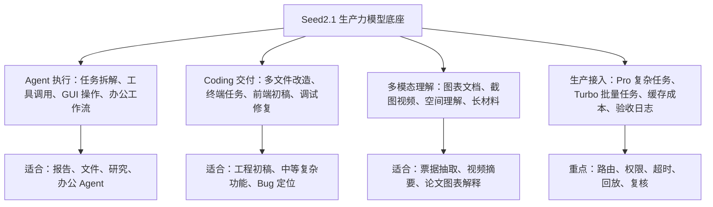
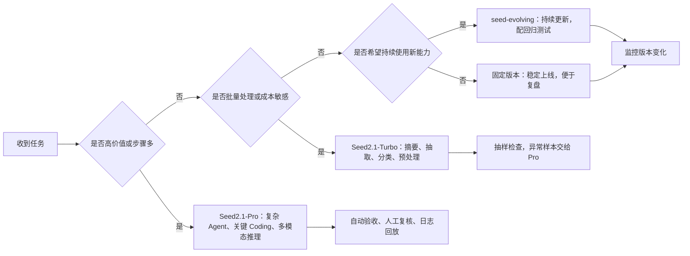
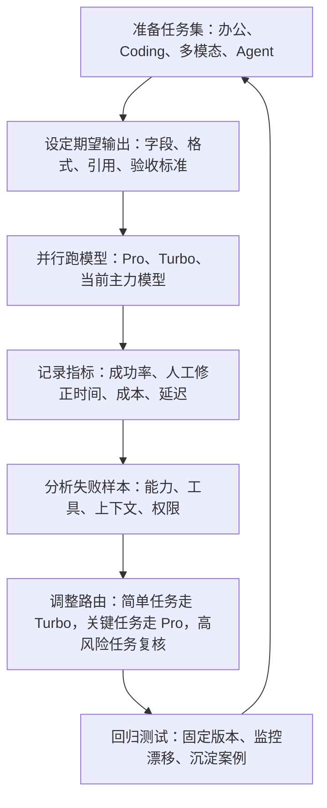

# 火山 Seed2.1 详细测评：Agent、Coding、多模态到底强在哪里

**来源**: https://waytoagi.feishu.cn/wiki/D4CkwmMQWihS25kQfGkc5PmHnzh

---

## 摘要

Seed2.1是字节跳动推出的新一代多模态大模型，显著增强了Agent执行、代码工程交付和复杂办公任务处理能力。它在保留多模态理解强项的基础上，能独立完成文件处理、图像视频理解、代码编写与工具调用等任务。模型分为Pro和Turbo两版，分别面向高价值复杂任务与规模化调用场景，实际应用建议将其纳入明确的任务流程与验收体系中。

---

## 正文

# 火山 Seed2.1 详细测评：Agent、Coding、多模态到底强在哪里

> 写作时间：2026-06-23  
> 文章定位：资料整合型测评 + 选型建议 + 上线测试清单  
> 主要资料：Seed 官方发布页、Seed 官方博客、字节跳动 Seed 微信公众号、火山引擎 FORCE 大会现场观察、公开价格与模型 ID 信息

## 一句话结论

Seed2.1 是字节跳动于 2026 年 6 月 23 日推出的新一代多模态大模型，具备读取文件、理解图像与视频、编写代码、调用工具并独立完成复杂办公与开发任务的能力。

Seed2.1 这次最值得看的地方，是它在保留 Seed 系列多模态优势的同时，明显增强了 Agent 执行、代码工程交付和复杂办公任务处理。

如果用一句偏口语的话概括：**Seed2.1 在 Coding 和 Agent 两张桌子上都已经能坐下来干活。**它更适合作为“会看复杂材料、会拆任务、会调工具、能产出初稿或代码、能做一轮自检”的生产力模型使用。真正上线时，建议把它放进明确的任务流程、权限边界和验收体系里，而不建议只看聊天体验来判断价值。

| 维度 | 结论 | 适合怎么用 |
|-|-|-|
| Agent | 明显增强，尤其是办公任务、GUI 操作、工具调用、长链路任务 | 报告生成、文件处理、网页或桌面任务、企业内部助手 |
| Coding | 已经可用于真实工程任务，但顶级复杂仓库仍要严谨验收 | 多文件改造、代码解释、调试、脚手架生成、前端页面初稿 |
| 多模态 | 仍是强项，图表、文档、视频、空间理解表现突出 | 图文理解、视频摘要、视觉问答、PPT 与报告素材处理 |
| 成本 | Pro 面向高价值复杂任务，Turbo 面向规模化调用 | Pro 做判断与交付，Turbo 做摘要、抽取、分类、预处理 |
| 风险 | 深度思考延迟、上下文上限、版本漂移、工具权限与成本监控都要单独设计 | 需要自建测试集、日志、回放、自动验收和人工复核 |

## 图示导读：四张图先看懂 Seed2.1

<callout emoji="📌">
这几张图用于快速建立判断框架：先看能力地图，再看 Pro/Turbo 选型，接着看上线架构，最后看评测闭环。
</callout>

### 图 1：Seed2.1 能力地图



### 图 2：Pro / Turbo / Evolving 选型路径



### 图 3：推荐上线架构


### 图 4：评测闭环



## 这篇测评怎么读

这篇文章会做三件事：整理发布信息、解释跑分含义、给出可执行测试方案。更实用的读法是：

1. 先看“适合谁用”，判断要不要纳入模型池。
2. 再看 Agent、Coding、多模态三块能力，判断适合承担哪一段工作。
3. 最后看接入建议和测试清单，把它变成可执行的选型动作。

如果你现在已经在用 Claude Code、Cursor、Trae、Coze、豆包、火山方舟或内部 Agent 平台，Seed2.1 最值得测试的方向是：中文复杂材料、多模态输入、办公文件、可控工具调用，以及需要成本和延迟平衡的批量任务。

## 1. Seed2.1 到底发布了什么

Seed2.1 于 2026-06-23 正式发布，核心是把评价重点调整为**真实工作流表现**：能不能拆任务、执行、调工具、把结果交付出来。官方重点放在三方向：

| 方向 | 官方重点 | 实际含义 |
|-|-|-|
| 通用 Agent | 更可靠的任务规划、工具调用、GUI 操作、多步执行 | 模型要能完成一串真实动作，回答问题只是其中一环 |
| 代码工程 | 更稳定的代码生成、修改、调试、交付 | 从单文件补全扩展到仓库级任务和真实开发反馈 |
| 基础能力 | 知识、推理、多模态、长上下文、视频理解增强 | 支撑 Agent 和 Coding 的底层理解能力更完整 |

### 可用入口

| 入口 | 适合人群 | 适合任务 |
|-|-|-|
| 豆包电脑版和 App 的办公任务 | 普通办公用户、内容团队、运营团队 | 文档分析、PPT、表格、报告、资料整理 |
| TRAE Work 和 TRAE IDE | 开发者、产品工程团队 | 代码生成、调试、仓库级任务、工程协作 |
| 火山方舟体验中心和 API | 企业开发者、平台团队 | 模型评测、应用接入、批量处理、Agent 系统 |
| Coze 和相关 Agent 平台 | Agent 设计者、业务自动化团队 | 工作流编排、工具调用、客服或运营助手 |

### 模型形态

| 模型 | 建议定位 | 适合任务 |
|-|-|-|
| Doubao-Seed-2.1-Pro | 高质量、复杂任务、深度思考 | Agent 长链路、复杂 Coding、多模态推理、关键交付 |
| Doubao-Seed-2.1-Turbo | 更低成本、更低延迟、高吞吐 | 摘要、抽取、分类、批量处理、在线高频调用 |
| doubao-seed-evolving | 持续更新的统一模型 ID | 适合希望持续使用较新能力的场景，生产稳定性要额外监控 |
| doubao-seed-character | 角色对话与拟人化交互 | 角色扮演、陪伴、虚拟人、人格化助手 |

参考价格（以火山方舟控制台为准）：Pro 输入 6 元 / 输出 30 元每百万 tokens；Turbo 输入 3 元 / 输出 15 元每百万 tokens；缓存命中更低。

## 2. Agent：重点是"可执行"

Seed2.1 这轮发布最应该优先看的能力就是 **Agent**。

Seed 官方这次把大量评测放在真实任务和工具环境里，包括 Workspace Bench、Agent Startup Bench、GDPVal、ALE、MobileWorld、OSWorld、CreativeWork、Toolathlon 等。简单说，官方想证明的是：Seed2.1 能回答问题，也能在一个有文件、有工具、有界面、有步骤的环境里完成任务。

| Benchmark | Seed2.1-Pro | Seed2.1-Turbo | 对比参考 | 怎么理解 |
|-|-|-|-|-|
| Agent Startup Bench | 68.8 | 54.0 | GPT-5.5 为 68.1，Claude Opus 4.7 为 62.3 | Pro 在创业任务模拟中很强，偏真实商业工作流 |
| Workspace Bench | 53.0 | 54.7 | Claude Opus 4.7 为 55.1，GPT-5.5 为 58.7 | 办公空间任务接近第一梯队 |
| xDailyBench | 61.0 | 56.4 | GPT-5.5 为 73.0，Claude Opus 4.7 为 69.0 | 日常多步任务仍有差距 |
| MobileWorld | 官方称达到最高成绩 | 未列出统一数字 | 手机 GUI 任务 | 说明移动端界面操作是重点方向 |
| OSWorld | 官方称保持有竞争力表现 | 未列出统一数字 | 电脑系统环境任务 | 说明桌面任务可进入测试 |

这里的关键判断是：**Seed2.1-Pro 已经可以作为“复杂工作流执行模型”纳入测试**，尤其适合中文办公、文件处理、多模态材料和工具调用混合的任务。价值主要来自复杂材料间建立联系、跨工具执行、GUI 与 MCP 工具组合使用。


### Agent 场景里，Seed2.1 适合做什么

| 场景 | 推荐模型 | 使用方式 | 验收指标 |
|-|-|-|-|
| 会议纪要整理成待办 | Turbo 或 Pro | Turbo 做摘要，Pro 做任务拆解和优先级 | 待办完整率、负责人识别率、误加任务率 |
| 多文件报告生成 | Pro | 读取文件、提纲、搜索补充、生成报告、自检引用 | 信息覆盖率、引用准确率、结构清晰度 |
| 发票和合同信息抽取 | Turbo 起步，关键字段用 Pro 复核 | OCR 或文件解析后结构化抽取 | 字段准确率、重复率、人工修正时间 |
| 竞品或行业研究 | Pro | 搜索、整理、归因、生成判断 | 来源质量、结论可复核性、遗漏率 |
| GUI 自动操作 | Pro | 让模型规划步骤，外层系统负责权限和日志 | 成功率、步骤数、回退能力 |

### 卡兹克文章里的办公 Agent 观察

> 原文链接：https://mp.weixin.qq.com/s/p10dn6zpSR4D5u9BOF9FeQ

卡兹克这篇文章里有几个信息很有参考价值：

1. 豆包办公任务模式基于 Seed2.1-Pro，已经能访问本地文件，并结合技能和权限请求完成任务。
2. 发票案例里，把 210 张发票整理成飞书多维表格，说明它适合文件批处理和结构化录入。
3. 办公选址案例里，模型会做联网研究、对比办公地点、整理判断，说明研究型 Agent 已具备可用形态。
4. PPT 生成能力可用，但视觉质量会受技能、模板和生成链路影响。
5. 数据分析任务里，模型会主动探索，也可能走进错误路径，所以需要明确的验证与约束。

这个观察很重要：Agent 能力的真实价值，往往由模型和外层产品形态共同决定。文件权限、技能系统、工具质量、回退机制、模板能力、日志和用户确认，都会影响最后效果。

## 3. Coding：能上工程场景，但要配验收

Seed2.1 的 Coding 能力这次明显增强。

官方在公共 Benchmark、代码库级修改和开发者众测上都有提升。在 Arena 的 Code Arena Frontend 排名第 8（分数 1539），7 个前端子类中 5 个进前 10；众测中相比 Claude Opus 4.6 获 59.1% 胜率。

| Benchmark | Seed2.1-Pro | Seed2.1-Turbo | Claude Opus 4.7 | GPT-5.5 | Gemini 3.1 Pro |
|-|-|-|-|-|-|
| NL2Repo-Bench | 47.0 | 43.7 | 58.2 | 45.1 | 33.4 |
| Terminal Bench 2.1 | 71.0 | 67.6 | 71.7 | 73.8 | 70.7 |
| SWE-Atlas | 35.2 | 30.6 | 38.7 | 44.7 | 23.6 |

<callout emoji="📌">
**官方 Wiki 补充：**Seed2.1-Pro 在众测开发者评估中，相比 Claude Opus 4.6 获得 59.1% 胜率；Seed2.1-Pro-Preview 在 Code Arena Frontend 排名第 8，分数 1539，并在 7 个前端子类别中的 5 个进入前 10。
</callout>

这组信息可以补强 Coding 章节的判断：Seed2.1 的工程价值不仅来自公开基准，也来自更贴近真实仓库任务的开发者偏好评估。


这组数字说明：

终端/工程执行类任务，Pro 已接近第一梯队；更难的仓库级修复和复杂软工问题，Claude、GPT 仍占优。Pro 已能进入真实工程测试，Turbo 适合更轻量的解释、初稿、批量任务。

### Coding 任务怎么用 Seed2.1

| 任务类型 | 推荐模型 | 建议流程 |
|-|-|-|
| 代码解释、重构建议、单文件修改 | Turbo 或 Pro | 先让模型解释，再给出 diff，最后跑测试 |
| 多文件功能改造 | Pro | 要求模型先列计划，再分步修改，每步附验证方式 |
| 前端页面生成 | Pro | 给设计约束、组件库、截图验收，必要时配浏览器测试 |
| 线上 Bug 修复 | Pro | 提供日志、复现步骤、相关文件，要求最小改动 |
| 复杂仓库级任务 | Pro + 更强代码模型复核 | Seed2.1 做方案和初稿，关键提交用第二模型或人工审查 |

### 社区实测里的 Coding 信号

卡兹克文章的 AIHOT 改造案例很适合作为参考：

1. 切换到 Seed2.1-Pro 后，模型完成了多模态总结能力改造。
2. 初期出现深度思考导致响应慢、超时、图片包装器 Bug 等问题。
3. 修复后跑了 100 条数据回测，延迟约 3.5 秒，摘要准确性评价很高。
4. UI 交付“中规中矩”，说明功能完成度优先于设计质感。

这个案例可以提炼出一条实用经验：Seed2.1-Pro 适合做工程实现，但要准备超时策略、失败重试、明确的测试集和代码审查。它能显著降低“从需求到可运行版本”的时间，但不能省掉验证。

## 4. 多模态：优势项还在，更适合和 Agent 结合

Seed2.1 继续强化了图像、图表、长文档、视频和空间理解，已覆盖"看图回答"之外的复杂生产流程（看文档/图表/论文图、看视频出脚本与摘要、看 UI 出前端建议、看票据出结构化信息、多材料出报告）。

| Benchmark | Seed2.1-Pro | Seed2.1-Turbo | 对比参考 | 怎么看 |
|-|-|-|-|-|
| MathVision | 92.6，工具版 94.5 | 90.1，工具版 92.7 | GPT-5.5 为 92.2，Gemini 3.1 Pro 为 89.2 | 数学视觉理解很强 |
| MMMU-Pro | 81.6，工具版 82.7 | 80.1，工具版 82.2 | GPT-5.5 为 81.2，Gemini 3.1 Pro 为 80.5 | 多学科视觉问答接近顶级 |
| WorldVQA | 53.0 | 48.6 | Claude Opus 4.7 为 35.9，GPT-5.5 为 34.6 | 世界知识视觉问答优势明显 |
| CharXiv-RQ | 85.4，工具版 86.4 | 82.5，工具版 83.6 | GPT-5.5 为 83.2，Gemini 3.1 Pro 为 83.5 | 图表和论文图理解很强 |
| ERQA | 72.0 | 71.3 | GPT-5.5 为 64.5，Gemini 3.1 Pro 为 70.8 | 视觉阅读理解表现突出 |
| MMLongBench-128K | 78.3 | 76.9 | Gemini 3.1 Pro 为 70.7 | 长上下文多模态材料更值得测 |

视频理解方面，官方给出的数据也很强：

| Benchmark | Seed2.1-Pro | Seed2.1-Turbo | 对比参考 |
|-|-|-|-|
| VideoMME | 89.2 | 89.0 | Gemini 3.5 Flash 为 87.2 |
| TOMATO | 79.5 | 56.8 | Gemini 3.5 Flash 为 71.9 |
| Minerva | 70.7 | 65.9 | Gemini 3.5 Flash 为 68.6 |
| OVOBench Streaming | 80.7 | 79.2 | Gemini 3.5 Flash 为 64.5 |
| VideoSimpleQA | 76.4 | 71.4 | Gemini 3.5 Flash 为 76.0 |

<callout emoji="📌">
**官方 Wiki 补充：**多模态部分的关键信号，是复杂视觉信息、空间理解、长上下文多模态材料、长视频和流式视频能力一起增强。它们共同服务 Agentic 场景，单次图像问答只是其中一类。
</callout>

如果要测 Seed2.1 的多模态能力，建议优先选择 PDF、报告图表、票据截图、长视频、会议录屏和产品界面这几类材料。


### 最值得测的多模态任务

| 任务 | 推荐模型 | 为什么适合 |
|-|-|-|
| 财报截图和图表解读 | Pro | 需要视觉、数字和业务理解同时在线 |
| 发票和票据批量抽取 | Turbo + Pro 抽检 | Turbo 低成本处理，Pro 检查异常 |
| 长视频变成图文报告 | Pro | 需要长时序理解和结构化表达 |
| 产品截图生成 PRD | Pro | 需要理解界面、流程和用户意图 |
| 论文图表转中文解释 | Pro | CharXiv-RQ 和长文档能力相关度高 |

### 官方补充：Seed for Seed 研发闭环

Seed 官方材料里还有一个容易被忽略的信息：Seed2.1 已经开始参与模型研发流程本身，包括评测系统构建、能力诊断、SFT 数据合成、RL 训练框架优化，以及把研究论文中的方法落实到代码和实验中验证。

这说明 Seed2.1 的 Agent 能力也在内部研发场景里接受长周期任务验证。对企业用户来说，这个信号的价值在于：可以把 Agent 看成一种可被组织、评测、分工和持续改进的工作单元。


## 5. 跑分怎么看：不只看名次，还要看任务类型

模型发布时，跑分很容易让人误判。更好的看法是把 Benchmark 分成三类：

| 类型 | 看什么 | Seed2.1 的信号 |
|-|-|-|
| 基础能力 | 知识、推理、数学、长上下文 | Pro 和 Turbo 都在第一梯队，Pro 更稳 |
| 生产力能力 | Agent、Workspace、Coding、GUI | Pro 明显进入可用区间，部分任务接近或超过强对手 |
| 多模态能力 | 图像、视频、图表、视觉问答 | Seed2.1 是强项明显的模型 |

一个实用判断：

1. 如果你的任务是“问答聊天”，Seed2.1 的优势未必完全体现。
2. 如果你的任务是“复杂材料 + 工具调用 + 交付结果”，Seed2.1 值得认真评测。
3. 如果你的任务是“高难代码修复 + 大型仓库 + 极低失败率”，仍然建议与 Claude、GPT、Gemini 等模型做横向复测。
4. 如果你的任务是“中文办公、多模态材料、结构化抽取、报告生成”，Seed2.1 的收益会更直观。

## 6. Pro、Turbo、Evolving 怎么选

### 快速选型表

| 任务特点 | 推荐选择 | 理由 |
|-|-|-|
| 任务复杂、步骤多、失败代价高 | Pro | 更适合深度思考、Agent 和关键交付 |
| 批量处理、可容忍抽检、成本敏感 | Turbo | 单价更低，适合大规模摘要、抽取、分类 |
| 希望持续获得最新能力 | Evolving | 能持续更新，但要监控版本变化 |
| 角色扮演、拟人化交互 | Character | 更适合人格化对话 |
| 线上稳定业务 | 固定版本模型 | 减少版本漂移，便于回归测试 |

### 推荐的模型路由

可以把 Seed2.1 放进下面这种路由里：

```text
用户输入
  -> 任务分类
  -> 简单摘要/抽取/分类：Turbo
  -> 复杂判断/多步 Agent/代码交付：Pro
  -> 超难代码或强审美前端：Pro 生成 + 其他强代码模型复核
  -> 关键输出：自动验收 + 人工复核
  -> 日志、成本、延迟、失败原因沉淀
```

这个结构的好处是：Turbo 承担吞吐，Pro 承担关键判断，外层系统承担权限、工具、验收和回放。

## 7. 接入建议：别只换模型，要补齐工程外壳

### 7.1 做模型路由

不要让所有请求都走 Pro。建议按任务拆成四类：

| 任务类型 | 模型 | 说明 |
|-|-|-|
| 低风险文本处理 | Turbo | 摘要、分类、标签、改写、轻量问答 |
| 高价值交付 | Pro | 报告、代码、分析、决策建议 |
| 多模态理解 | Pro 或 Turbo | 批量用 Turbo，复杂图表用 Pro |
| 高风险输出 | Pro + 复核 | 金融、法务、医疗、人事、代码上线前必须复核 |

### 7.2 控制深度思考成本

深度思考能提升复杂任务质量，但也会增加延迟和 token 成本。建议：

1. 给任务设置“是否需要深度思考”的开关。
2. 对简单任务限制输出长度。
3. 对长任务设置阶段性超时。
4. 对 Agent 任务设置最大步骤数。
5. 对失败任务保存完整日志，方便回放。

### 7.3 给 Agent 明确权限

Agent 最怕权限模糊。上线时应明确：

| 权限 | 建议 |
|-|-|
| 读文件 | 默认允许指定目录，敏感目录需确认 |
| 写文件 | 默认先生成草稿，最终写入需确认 |
| 联网搜索 | 记录来源，关键结论必须附链接 |
| 调 API | 限制接口、参数、频率和预算 |
| 发消息或提交任务 | 需要用户确认，保留审计记录 |

### 7.4 给输出设计验收

只看“回答像不像”不够。更好的验收是：

| 输出类型 | 验收方式 |
|-|-|
| 报告 | 引用能打开，数字能复算，结论能追溯 |
| 代码 | 测试通过，lint 通过，关键路径跑通 |
| 表格抽取 | 抽样校验，字段准确率，重复率 |
| PPT | 结构完整，页面不溢出，图表来源清楚 |
| 视频摘要 | 时间点准确，人物和事件不混淆 |

### 7.5 记录失败样本

模型选型最重要的资产是失败样本库。建议每次测试都记录：

1. 输入材料。
2. 期望输出。
3. 模型输出。
4. 错误类型。
5. 是否可通过提示词修复。
6. 是否需要工具或数据补充。
7. 修复后的成本和延迟。

这样你会很快知道：Seed2.1 适合你的哪类任务，也会知道它在哪些任务上需要其他模型或人工复核。

## 8. 可以直接复制的 10 个测试任务

下面这组测试任务适合拿来快速判断 Seed2.1 是否适合你的团队。

| 编号 | 测试任务 | 推荐模型 | 看什么 |
|-|-|-|-|
| 1 | 给 20 页行业报告生成中文摘要、关键数据表、风险判断 | Pro | 长文档理解、结构化能力、引用准确性 |
| 2 | 给 100 张发票截图抽取金额、日期、抬头、税号 | Turbo + Pro 抽检 | 批量抽取成本、字段准确率 |
| 3 | 给一个历史会议纪要生成待办清单和负责人 | Turbo 或 Pro | 任务识别、责任归属、优先级 |
| 4 | 给一个小型代码仓库增加登录态或导出功能 | Pro | 多文件修改、测试意识、最小改动 |
| 5 | 给一个报错日志定位 Bug 并生成补丁 | Pro | 诊断准确性、修复质量 |
| 6 | 给产品截图生成 PRD 和前端实现方案 | Pro | UI 理解、产品表达、工程可执行性 |
| 7 | 给一段长视频生成时间线、重点片段和传播标题 | Pro | 视频理解、摘要结构、内容判断 |
| 8 | 给 5 个竞品网页生成对比表和机会点 | Pro | 联网研究、归因、商业判断 |
| 9 | 给复杂 Excel 表生成异常点和管理层解读 | Pro | 表格理解、数据分析、结论稳健性 |
| 10 | 同一批任务分别跑 Pro、Turbo 和当前主力模型 | 三者对比 | 成本、延迟、成功率、人工修正时间 |

核心指标：一次成功率、人工修正时间、引用准确率、工具调用成功率、平均延迟、单任务成本、失败可恢复率。

## 9. 风险和边界

| 风险 | 说明 | 应对 |
|-|-|-|
| 深度思考延迟 | 默认深思慢，甚至触发 300 秒超时 | 设开关 + 分级超时，不让所有请求走最慢路径 |
| 长上下文上限 | 社区文章提到仍是 256K 级别，未达 1M | 材料切分、检索、摘要缓存、引用回链 |
| Coding 上线 | 多文件/迁移/权限/支付登录订单/前端等关键路径不能跳测试 | 自动测试 + 人工 review + 二模型复核 |
| Agent 依赖外层 | 模型只是一环，效果由工具/权限/上下文/界面/回退共同决定 | 明确可访问范围、写入边界、回滚、确认节点、日志 |
| Evolving 漂移 | 统一 ID 持续更新，同任务行为可能随时间变化 | 严肃生产固定版本 + 建回归测试 |

## 10. 最后判断：Seed2.1 应该怎么定位

Seed2.1 更像一个面向生产力系统的**底座模型**：多模态强、中文友好、Agent 增强、Coding 已能进入真实工程试用。最实用的用法是让它承担"看懂复杂材料 + 规划步骤 + 调工具 + 生成初稿或代码 + 做一轮自检"，人负责目标定义、关键判断、验收标准和风险边界。

| 角色 | 是否推荐 | 说明 |
|-|-|-|
| 中文办公 Agent 底座 | 推荐 | 文件、表格、报告、PPT、研究任务都有测试价值 |
| 多模态理解模型 | 推荐 | 图表、截图、视频、长材料是强项 |
| 批量摘要和抽取模型 | 推荐 Turbo 起步 | 成本更友好，可配 Pro 抽检 |
| 通用 Coding 主力模型 | 可以测试 | 适合工程初稿和中等复杂任务，关键任务要验收 |
| 顶级复杂仓库修复唯一模型 | 谨慎 | 建议横向对比 Claude、GPT、Gemini 等模型 |
| 高风险自动决策模型 | 谨慎 | 需要人工确认、审计日志和严格权限 |

若团队已有模型路由、RAG、Agent 工具链或自动化工作流，Seed2.1 值得加入候选池，建议从中文办公、多模态材料、表格抽取、代码初稿、研究报告五类任务开始测。

## 资料来源

1. [Seed2.1 官方页面](https://seed.bytedance.com/en/seed2_1)
2. [Seed 官方博客：Seed2.1 Officially Released: Advancing AI Productivity](https://seed.bytedance.com/en/blog/seed2-1-officially-released-advancing-ai-productivity)
3. [Seed 官方博客：Seed 2.1 Preview Model Release on Arena](https://seed.bytedance.com/en/blog/seed-2-1-preview-model-release-on-arena)
4. [字节跳动 Seed 微信公众号：Seed2.1 正式发布，深入 AI 生产力](https://mp.weixin.qq.com/s/lU3ctCGQFL1aNEVSYlSX7A)
5. [数字生命卡兹克：一文总结2026火山引擎FORCE大会 - 向Coding和Agent全面进军](https://mp.weixin.qq.com/s/p10dn6zpSR4D5u9BOF9FeQ)
6. [火山引擎文档：深度思考模型](https://www.volcengine.com/docs/82379/1956279)
7. [WaytoAGI Wiki：Seed2.1 正式发布，深入 AI 生产力](https://waytoagi.feishu.cn/wiki/TaalwUxMyiU0uokVjKfcEIGgnWc)
8. [IT之家：火山引擎发布豆包大模型 1.6、Seed2.1 等相关信息](https://www.ithome.com/0/967/314.htm)